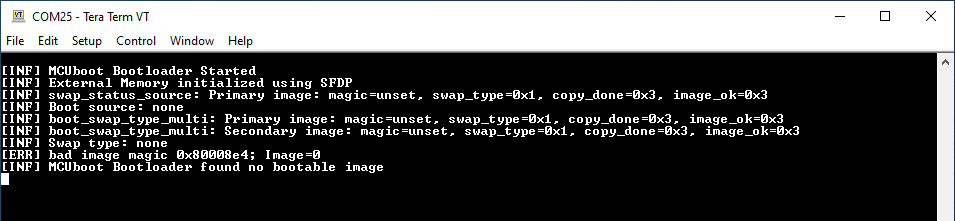
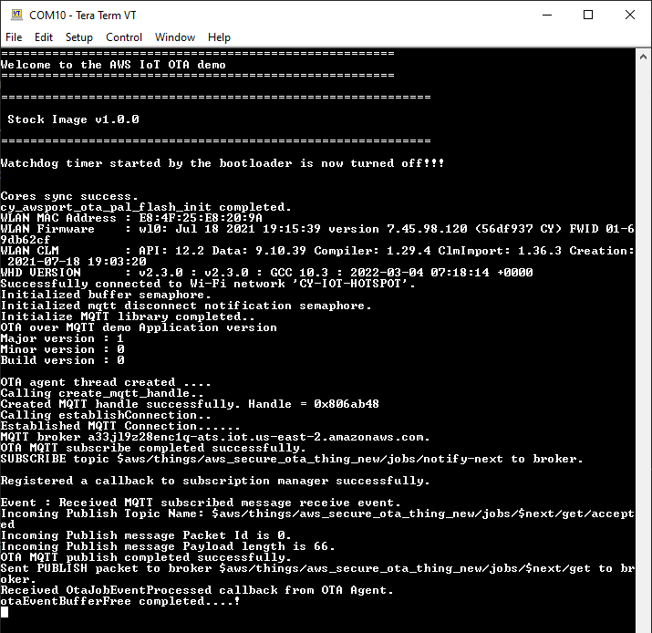
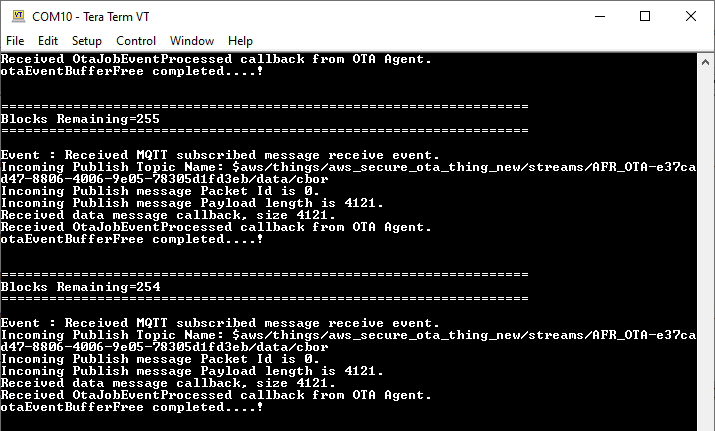
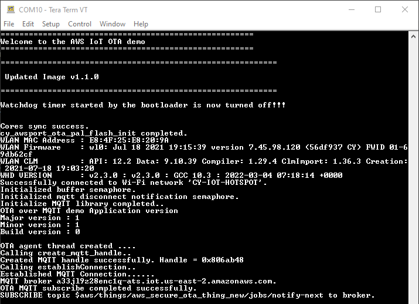
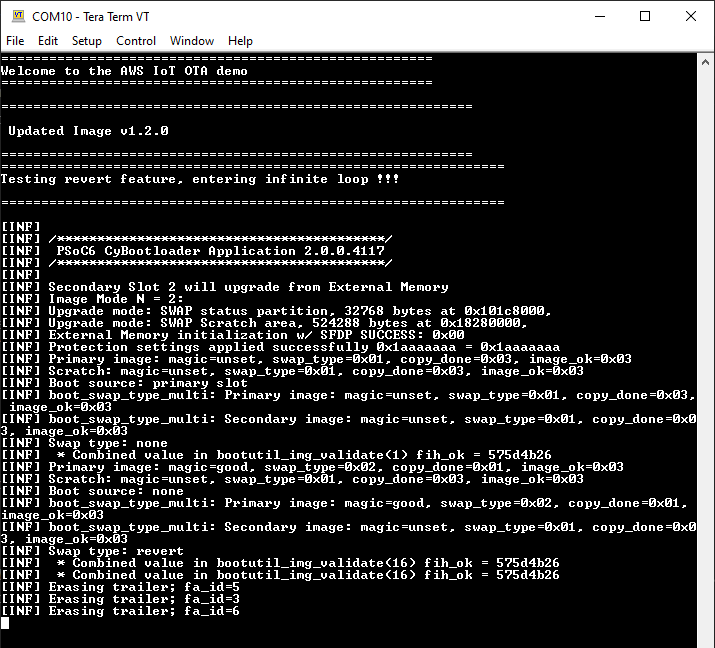

# AWS IoT: Over-the-air firmware update using MQTT

This code example demonstrates an OTA update with PSoC&trade; 6 MCU and AIROC™ CYW43xxx Wi-Fi & Bluetooth® combo chips. The example uses the [AWS SDK for Embedded C](https://github.com/aws/aws-iot-device-sdk-embedded-C) and [AWS IoT device sdk port](https://github.com/Infineon/aws-iot-device-sdk-port) to connect and communicate with the AWS IoT MQTT core. 

The device establishes a connection with the AWS IoT MQTT core and subscribes to an OTA job topic. When a new update is available, it is downloaded and written to the secondary slot. On the next reboot, MCUboot swaps the new image in the secondary slot with the primary slot image and runs the application. If the new image is not validated in runtime, on the next reboot, MCUboot reverts to the previously validated image.

MCUboot is a "secure" bootloader for 32-bit MCUs. See the [README](https://github.com/Infineon/mtb-example-psoc6-mcuboot-basic/blob/master/README.md) of the [mtb-example-psoc6-mcuboot-basic](https://github.com/Infineon/mtb-example-psoc6-mcuboot-basic) code example for more details.

[Provide feedback on this code example.](https://cypress.co1.qualtrics.com/jfe/form/SV_1NTns53sK2yiljn?Q_EED=eyJVbmlxdWUgRG9jIElkIjoiQ0UyMzQ3NzYiLCJTcGVjIE51bWJlciI6IjAwMi0zNDc3NiIsIkRvYyBUaXRsZSI6IkFXUyBJb1Q6IE92ZXItdGhlLWFpciBmaXJtd2FyZSB1cGRhdGUgdXNpbmcgTVFUVCIsInJpZCI6Inlla3QiLCJEb2MgdmVyc2lvbiI6IjEuMC4wIiwiRG9jIExhbmd1YWdlIjoiRW5nbGlzaCIsIkRvYyBEaXZpc2lvbiI6Ik1DRCIsIkRvYyBCVSI6IklDVyIsIkRvYyBGYW1pbHkiOiJQU09DIn0=)

## Requirements

- [ModusToolbox&trade; software](https://www.cypress.com/products/modustoolbox-software-environment) v2.4 or later (tested with v2.4)
- Board support package (BSP) minimum required version: 3.0.0
- Programming language: C
- Associated parts: All [PSoC&trade; 6 MCU](http://www.cypress.com/PSoC6) parts with SDIO interface, [AIROC™ CYW43xxx Wi-Fi & Bluetooth® combo chips](https://www.cypress.com/products/airoc-wi-fi-combos)

## Supported toolchains (make variable 'TOOLCHAIN')

- GNU Arm® embedded compiler v10.3.1 (`GCC_ARM`) - Default value of `TOOLCHAIN`
- Arm&reg; compiler v6.13 (`ARM`)
- IAR C/C++ compiler v8.42.2 (`IAR`)

## Supported kits (make variable 'TARGET')

- [PSoC&trade; 64 Standard Secure - AWS Wi-Fi BT Pioneer Kit](https://www.cypress.com/CY8CKIT-064S0S2-4343W) (`CY8CKIT-064S0S2-4343W`) - Default value of `TARGET`
- [PSoC&trade; 64 "Secure Boot" Wi-Fi Bluetooth&reg; pioneer kit](https://www.cypress.com/CY8CKIT-064B0S2-4343W) (`CY8CKIT-064B0S2-4343W`)
- [PSoC&trade; 6 Wi-Fi Bluetooth&reg; pototyping kit](https://www.cypress.com/CY8CPROTO-062-4343W) (`CY8CPROTO-062-4343W`)
- [PSoC&trade; 62S2 Wi-Fi Bluetooth&reg; pioneer kit](https://www.cypress.com/CY8CKIT-062S2-43012) (`CY8CKIT-062S2-43012`)
- [PSoC&trade; 62S2 evaluation kit](https://www.cypress.com/CY8CEVAL-062S2) (`CY8CEVAL-062S2-LAI-4373M2`, `CY8CEVAL-062S2-MUR-43439M2`)

## Hardware setup

This example uses the board's default configuration. See the kit user guide to ensure that the board is configured correctly.

## Software setup

Install a terminal emulator if you do not have one. Instructions in this document use [Tera Term](https://ttssh2.osdn.jp/index.html.en).

## Structure and overview

This code example is a dual-core project, where the MCUboot bootloader app runs on the CM0+ core and the OTA update app runs on the CM4 core. The OTA update app fetches the new image and places it in the flash memory; the bootloader takes care of updating the existing image with the new image. 

For the PSoC&trade; 64 series MCU, the pre-built bootloader is programmed automatically during the provisioning process. 

For the PSoC&trade; 62 series MCU, the [mtb-example-psoc6-mcuboot-basic](https://github.com/Infineon/mtb-example-psoc6-mcuboot-basic) code example is the bootloader project. The bootloader project and this OTA update project should be built and programmed independently. They must be placed separately in the workspace as you would do for any other two independent projects. An example workspace would look something like this:

   ```
   <example-workspace>
      |
      |-<mtb-example-psoc6-mcuboot-basic>
      |-<mtb-example-aws-iot-ota-mqtt>
      |
   ```

You must first build and program the MCUboot bootloader project into the CM0+ core; this needs to be done only once. The OTA update app can then be programmed into the CM4 core; you need to only modify this app for all application purposes.

## Using the code example

Create the project and open it using one of the following:

<details><summary><b>In Eclipse IDE for ModusToolbox&trade; software</b></summary>

1. Click the **New Application** link in the **Quick Panel** (or, use **File** > **New** > **ModusToolbox Application**). This launches the [Project Creator](http://www.cypress.com/ModusToolboxProjectCreator) tool.

2. Pick a kit supported by the code example from the list shown in the **Project Creator - Choose Board Support Package (BSP)** dialog.

   When you select a supported kit, the example is reconfigured automatically to work with the kit. To work with a different supported kit later, use the [Library manager](https://www.cypress.com/ModusToolboxLibraryManager) to choose the BSP for the supported kit. You can use the Library Manager to select or update the BSP and firmware libraries used in this application. To access the Library manager, click the link from the **Quick Panel**.

   You can also just start the application creation process again and select a different kit.

   If you want to use the application for a kit not listed here, you may need to update the source files. If the kit does not have the required resources, the application may not work.

3. In the **Project Creator - Select Application** dialog, choose the example by enabling the checkbox.

4. Optionally, change the suggested **New Application Name**.

5. Enter the local path in the **Application(s) Root Path** field to indicate where the application needs to be created.

   Applications that can share libraries can be placed in the same root path.

6. Click **Create** to complete the application creation process.

For more details, see the [Eclipse IDE for ModusToolbox&trade; software user guide](https://www.cypress.com/MTBEclipseIDEUserGuide) (locally available at *{ModusToolbox&trade; install directory}/ide_{version}/docs/mt_ide_user_guide.pdf*).

</details>

<details><summary><b>In command-line interface (CLI)</b></summary>

ModusToolbox&trade; software provides the Project Creator as both a GUI tool and a command line tool to easily create one or more ModusToolbox&trade; software applications. See the "Project Creator Tools" section of the [ModusToolbox&trade; software user guide](https://www.cypress.com/ModusToolboxUserGuide) for more details.

Alternatively, you can manually create the application using the following steps:

1. Download and unzip this repository onto your local machine, or clone the repository.

2. Open a CLI terminal and navigate to the application folder.

   On Windows, use the command line "modus-shell" program provided in the ModusToolbox&trade; installation instead of a standard Windows command line application. This shell provides access to all ModusToolbox&trade; tools. You can access it by typing `modus-shell` in the search box in the Windows menu.

   In Linux and macOS, you can use any terminal application.

   **Note:** The cloned application contains a default BSP file (*TARGET_xxx.mtb*) in the *deps* folder. Use the [Library manager](https://www.cypress.com/ModusToolboxLibraryManager) (`make modlibs` command) to select and download a different BSP file, if required. If the selected kit does not have the required resources or is not [supported](#supported-kits-make-variable-target), the application may not work.

3. Import the required libraries by executing the `make getlibs` command.

Various CLI tools include a `-h` option that prints help information to the terminal screen about that tool. For more details, see the [ModusToolbox&trade; software user guide](https://www.cypress.com/ModusToolboxUserGuide) (locally available at *{ModusToolbox&trade; install directory}/docs_{version}/mtb_user_guide.pdf*).

</details>

<details><summary><b>In third-party IDEs</b></summary>

1. Follow the instructions from the **In command-line interface (CLI)** section to create the application, and import the libraries using the `make getlibs` command.

2. Export the application to a supported IDE using the `make <ide>` command.

   For a list of supported IDEs and more details, see the "Exporting to IDEs" section of the [ModusToolbox&trade; software user guide](https://www.cypress.com/ModusToolboxUserGuide) (locally available at *{ModusToolbox&trade; install directory}/docs_{version}/mtb_user_guide.pdf*.

3. Follow the instructions displayed in the terminal to create or import the application as an IDE project.
</details>

## Provisioning the PSoC&trade; 64 devices

If you are **not** using a PSoC&trade; 64 device, skip this section.

This section will give instructions on provisioning the PSoC&trade; 64 devices for this example only. For more detailed information on PSoC&trade; 64 devices and provisioning, see [PSoC&trade; 64 Secure Boot user guide](https://www.cypress.com/documentation/software-and-drivers/psoc-64-secure-mcu-secure-boot-sdk-user-guide).

The root directory of the OTA application is referred to as *\<OTA Application>* in this document.

**Important**: The KitProg3 must be in DAPLink mode for performing this section. Press the 'Mode' button on the kit until the Status LED blinks fast. Also make sure that the J26 jumper is open. After the steps in this section are complete, undo to the previous state by pressing the 'Mode' button again until the Status LED stops blinking. Place the J26 jumper back.

<details><summary><b>For CY8CKIT-064S0S2-4343W kit</b></summary>

1. Open a CLI terminal.

   On Linux and macOS, you can use any terminal application. On Windows, open the "modus-shell" app from the Start menu.

2. Navigate the terminal to the *\<mtb_shared>/trusted-firmware-m/\<tag>/security* folder.

3. Run the following command.

      ```
      cysecuretools --target CY8CKIT-064S0S2-4343W init
      ```

4. In the same directory create a folder called `certificates` and navigate the terminal to the new directory.
      ```
      mkdir certificates
      cd certificates
      ```

5. Create a root CA key pair.
      ```
      openssl genrsa -out rootCA.key 2048 
      ```

6. Create a root CA certificate. When you run the following command you will be asked to enter some fields, fill them. You can leave the `Common Name` and `Email Address` fields empty.

      ```
      openssl req -x509 -new -nodes -key rootCA.key -sha256 -days 1024 -out rootCA.pem
      ```

7. Download the [Amazon Root CA certificate](https://www.amazontrust.com/repository/AmazonRootCA1.pem) and place it in the certificates directory. Keep the file name as `AmazonRootCA1.pem`.

8. Open the file *\<mtb_shared>/trusted-firmware-m/\<tag>/security/policy/policy_multi_CM0_CM4_tfm_dev_certs.json* in a text editor.

9. Edit the value of `set_img_ok` key to `false`.

10. Edit the value of `chain_of_trust` key to `["../certificates/device_cert.pem", "../certificates/AmazonRootCA1.pem"]`. Save the file and close it.

11. If you already have a provisined kit, skip to step 13.

12. Run the following commands in the modus-shell from *\<mtb_shared>/trusted-firmware-m/\<tag>/security* directory. 

      ```
      cysecuretools -t CY8CKIT-064S0S2-4343W -p policy/policy_multi_CM0_CM4_tfm.json create-keys
      cysecuretools -t CY8CKIT-064S0S2-4343W -p policy/policy_multi_CM0_CM4_tfm.json provision-device
      ```

13. Run the following command in the modus-shell from *\<mtb_shared>/trusted-firmware-m/\<tag>/security* directory, to re-provision the device. Select `yes` for all the questions asked. 
      ```
      python reprov_helper.py
      ```

      Note that this step generates a *device_cert.pem* certificate file in the *certificates* folder that you created in step 4. This is a self-signed device certificate. This certificate should be attached to the AWS IoT Thing when it is created; do not let AWS create ceritficates for you.

      The *device_cert.pem* file will be regenerated every time you run the *reprov_helper.py* python file. Take care to update the new device certificate to the AWS IoT Thing.
</details>

<details><summary><b>For CY8CKIT-064B0S2-4343W kit</b></summary>

1. Open a CLI terminal.

   On Linux and macOS, you can use any terminal application. On Windows, open the "modus-shell" app from the Start menu.

2. Navigate the terminal to the *\<OTA Application>* directory.

3. Run the following commands.

      ```
      cysecuretools --target CY8CKIT-064B0S2-4343W init
      cysecuretools -t CY8CKIT-064B0S2-4343W -p policy/policy_single_CM0_CM4_smif_swap.json create-keys
      ```

4. Open the file *\<OTA Application>/policy/policy_single_CM0_CM4_smif_swap.json* in a text editor.

5. Edit the value of `wdt_enable` keys to `true`. Note that `wdt_enable` key is present at two places, both the instances must have value `true`.

6. Edit the value of `set_img_ok` key to `false`.

7. Run the following command to provision the device.
      ```
      cysecuretools -t CY8CKIT-064B0S2-4343W -p policy/policy_single_CM0_CM4_smif_swap.json provision-device
      ```

      If you are re-provisioning the device, run the following command instead of the previous one.
      ```
      cysecuretools -t CY8CKIT-064B0S2-4343W -p policy/policy_single_CM0_CM4_smif_swap.json re-provision-device
      ```
</details>

## Building and programming MCUboot

If you are using a PSoC&trade; 64 device, skip this section. The pre-built MCUBoot bootloader is already programmed as part of the provisioning process.

The [mtb-example-psoc6-mcuboot-basic](https://github.com/Infineon/mtb-example-psoc6-mcuboot-basic) code example bundles two applications: the bootloader app that runs on CM0+ and the Blinky app that runs on CM4. For this code example, only the bootloader app is required. The root directory of the bootloader app is referred to as *\<bootloader_cm0p>* in this document.

1. Import the [mtb-example-psoc6-mcuboot-basic](https://github.com/Infineon/mtb-example-psoc6-mcuboot-basic) code example per the instructions in the [Using the code example](https://github.com/Infineon/mtb-example-psoc6-mcuboot-basic#using-the-code-example) section of its [README](https://github.com/Infineon/mtb-example-psoc6-mcuboot-basic/blob/master/README.md).

2. The bootloader and OTA applications must have the same understanding of the memory layout. Override the default memory layout by editing the make variables in the *\<bootloader_cm0p>/shared_config.mk* file. For this example, perform the following edits to match the memory layout with the OTA application:

   ```
   ifeq ($(USE_EXT_FLASH), 1)
   MCUBOOT_SLOT_SIZE=0x1C0000
   else
   MCUBOOT_SLOT_SIZE=0xF0000
   endif
   .
   .
   .
   MCUBOOT_SCRATCH_SIZE=0x4000
   ```

3. Copy the *\<mtb_shared>/mcuboot/\<tag>/boot/cypress/MCUBootApp/config* folder and paste it in the *\<bootloader_cm0p>* folder.

4. Edit the *\<bootloader_cm0p>/config/mcuboot_config/mcuboot_config.h* file and comment out the following defines to skip checking the image signature:

   ```
   #define MCUBOOT_SIGN_EC256
   #define NUM_ECC_BYTES (256 / 8)
   .
   .
   .
   #define MCUBOOT_VALIDATE_PRIMARY_SLOT
   ```

5. Edit *\<bootloader_cm0p>/app.mk* and replace the MCUboot include `$(MCUBOOTAPP_PATH)/config` with `./config`. This gets the build system to find the new copy of the config directory that you pasted in the *\<bootloader_cm0p>* directory, instead of the default one supplied by the library.

6. Edit *\<bootloader_cm0p>/Makefile*:

   1. Set `USE_EXT_FLASH` to '1', to use the external flash to store the secondary image.

   2. Set `SWAP_UPGRADE` to '1', to enable the swap feature of MCUboot.

7. Connect the board to your PC using the provided USB cable through the KitProg3 USB connector.

8. Open a CLI terminal.

   On Linux and macOS, you can use any terminal application. On Windows, open the "modus-shell" app from the Start menu.

9. Navigate the terminal to the *\<mtb_shared>/mcuboot/\<tag>/scripts* folder.

10. Run the following command to ensure that the required modules are installed or already present ("Requirement already satisfied:" is printed).

      ```
      pip install -r requirements.txt
      ```

11. Open a serial terminal emulator and select the KitProg3 COM port. Set the serial port parameters to 8N1 and 115200 baud.

12. Build and program the application per the [Step-by-Step](https://github.com/Infineon/mtb-example-psoc6-mcuboot-basic#step-by-step-instructions) instructions in its [README](https://github.com/Infineon/mtb-example-psoc6-mcuboot-basic/blob/master/README.md).

    After programming, the bootloader application starts automatically.

    **Figure 1. Booting with no bootable image**

    

## Create an AWS IoT Thing

To create the AWS IoT Thing, certificate, and private key, refer to [AWS Thing creation](https://docs.aws.amazon.com/iot/latest/developerguide/iot-moisture-create-thing.html) page.

The Thing needs to be created with following options:

- During device certificate configuration:
   - If you are using the CY8CKIT-064S0S2-4343 kit, select **Use my certificate** option and then select **CA is not registered with AWS IoT** option. Upload the *\<mtb_shared>/trusted-firmware-m/\<tag>/security/certificates/device_cert.pem* device certificate file.

      Or
   
   - If you are using any other kit, select **Auto-generate a new certificate** option.

- During attatchment of policy to the certificate, the policy should have the following attributes -
   - *Policy effect* - `Allow`
   - *Policy action* - All AWS IoT actions ie: `*`
   - *Policy resource* - `*` <br><br>

- When prompted for the certificate/keys dowload option, download the certificate, private key, and Amazon root CA certificate, as these will not be available to view after device creation finishes on the AWS portal.

## Configure AWS CLI

This section gives the instructions for installing and configuring AWS CLI. This tool will be used to push the update image to the AWS IoT OTA bucket.

**Note:** Add the ModusToolbox&trade; software python installation directory to your Windows user path (environmental variables), move the path to the top.

1. Open a CLI terminal.

   On Linux and macOS, you can use any terminal application. On Windows, open the "modus-shell" app from the Start menu.

2. Navigate the terminal to the *\<OTA Application>/scripts/* directory.

3. Run the following command to ensure that the required modules are installed or already present ("Requirement already satisfied:" is printed).

      ```
      pip install -r requirements.txt
      ```

4. Log in to your AWS IoT IAM account through a browser. Click on your name on the top right corner and select **security credentials**.

5. Under **AWS IAM Credentials** click on **Create access key**. Download the CSV and keep it safely.

6. On windows, open a command prompt.

7. Run the following command to configure your Identity and Access Management credentials with AWS CLI. This command creates and configures an AWS profile with the supplied name. This created profile will be used in steps like OTA job configuration.

   ```
   aws configure --profile <name_of_profile>
   ```

   If no profile name is provided, the credentials are stored with the profile name as `default`. When prompted, enter the following information -
   - Access Key ID (present in the CSV file downloaded earlier in step 5)
   - AWS Secret Access Key (present in the CSV file downloaded earlier in step 5)
   - Region (See [Region and Availability Zones](https://docs.aws.amazon.com/AmazonRDS/latest/UserGuide/Concepts.RegionsAndAvailabilityZones.html) to find the list of available regions, for example: us-east-2)
   - Output format (Enter `json`)
   <br>

8. From the modus-shell in *\<OTA Application>/scripts/* directory, run the following command. This will generate a private key for signing the OTA images.

      ```
      openssl genpkey -algorithm EC -pkeyopt ec_paramgen_curve:P-256 -pkeyopt ec_param_enc:named_curve -outform PEM -out ota-signing-private.pem
      ```

9. Create a new file named "cert_config.txt" in the *\<OTA Application>/scripts/* directory with the following contents. Modify *\<user_name>* and *\<domain>* to match your credentials. The email address used for the AWS account can also be used for the `commonName`.
   
      ```
      [ req ]
      prompt             = no
      distinguished_name = my_dn

      [ my_dn ]
      commonName = <user_name>@<domain>.com

      [ my_exts ]
      keyUsage         = digitalSignature
      extendedKeyUsage = codeSigning
      ```

10. Generate a code-signing certificate by running the following command in modus-shell from the *\<OTA Application>/scripts/* directory.

      ```
      openssl req -new -x509 -config cert_config.txt -extensions my_exts -nodes -days 365 -key ota-signing-private.pem -out ota-signing-private.crt
      ```

11. Register the certificate and private key with AWS Certificate Manager (ACM) by running the following command in windows command prompt in *\<OTA Application>/scripts/* directory.

      `<name_of_profile>` in the following command should be same as the one used in step 7.

      ```
      aws acm import-certificate --certificate fileb://ota-signing-private.crt --private-key fileb://ota-signing-private.pem --profile <name_of_profile> > ./certarn.json
      ```

**Note:** You can also submit the OTA job manually through the web console. See the "OTA Update Prerequisites" and "OTA Tutorial" sections in [FreeRTOS Over-the-Air Updates](https://docs.aws.amazon.com/freertos/latest/userguide/freertos-ota-dev.html) documentation.

## Operation

The device certificates, keys and the ota job code signing certificates needs to be passed from the application to the AWS cloud.

1. Connect the board to your PC using the provided USB cable through the KitProg3 USB connector.

2. Open a terminal program and select the KitProg3 COM port. Set the serial port parameters to 8N1 and 115200 baud.

3. Edit the *\<OTA Application>/source/credentials_config.h* file to configure your OTA application.

   1. Modify the connection configuration such as `WIFI_SSID`, `WIFI_PASSWORD`, and `WIFI_SECURITY` macros to match the settings of your Wi-Fi network.

   2. Modify the AWS IoT configurations such as `CLIENT_IDENTIFIER`, `AWS_IOT_ENDPOINT`, and `AWS_MQTT_PORT` macros to match your AWS IoT Thing settings.

   3. If you are **not** using the CY8CKIT-064S0S2-4343W kit, add the AWS IoT Thing certificates and private key to `aws_root_ca_certificate`, `aws_client_cert`, and `aws_client_key` variables. The certificates and keys were genererated in the section [Create an AWS IoT Thing](#create-an-aws-iot-thing).

      To convert the certificate and keys to string format use the *\<OTA Application>/scripts/PEMfileToCString.html*

4. Open a CLI terminal.

   On Linux and macOS, you can use any terminal application. On Windows, open the "modus-shell" app from the Start menu.

5. Navigate the terminal to the *\<OTA Application>/scripts/* directory.

6. Edit the *\<OTA Application>/configs/ota_config.h* file to add the OTA job signing certificate.

   Run the follwing command in the modus-shell.

   ```
   python format_cert_key.py ota-signing-private.crt
   ```

   Copy the formatted certificate from the modus-shell and add it the `AWS_IOT_OTA_SIGNING_CERT` macro in the *ota_config.h* file.

7. Program the board.

   <details open><summary><b>Using Eclipse IDE for ModusToolbox&trade; software</b></summary>

      1. Select the application project in the Project Explorer.

      2. In the **Quick Panel**, scroll down, and click **\<Application Name> Program (KitProg3_MiniProg4)**.
   </details>

   <details open><summary><b>Using CLI</b></summary>

     From the terminal, execute the `make program` command to build and program the application using the default toolchain to the default target. You can specify a target and toolchain manually:
      ```
      make program TARGET=<BSP> TOOLCHAIN=<toolchain>
      ```

      Example:
      ```
      make program TARGET=CY8CKIT-064S0S2-4343W TOOLCHAIN=GCC_ARM
      ```
   </details>

   At this point, the primary slot is programmed and the CM4 CPU starts running the image from the primary slot on reset. Observe the messages on the UART terminal. You should see that a stock image v1.0.0 is running. Wait for the device to make the required connections as shown in Figure 2.

   **Figure 2. Connection to the AWS IoT MQTT server**

   

8. Modify the value of app version in the *\<OTA Application>/Makefile* by setting `APP_VERSION_MINOR` to '1'.

9. Build the app (**DO NOT** program it to the kit). This new image will be uploaded to the MQTT bucket in the following steps to demonstrate OTA update.

   <details open><summary><b>Using Eclipse IDE for ModusToolbox&trade;</b></summary>

      1. Select the application project in the Project Explorer.

      2. In the **Quick Panel**, scroll down, and click **Build \<OTA Application> Application**.
   </details>

   <details open><summary><b>Using CLI</b></summary>

      1. From the terminal, execute the `make build` command to build the application using the default toolchain to the default target. You can specify a target and toolchain manually:
         ```
         make build TARGET=<BSP> TOOLCHAIN=<toolchain>
         ```
         Example:
         ```
         make build TARGET=CY8CKIT-064S0S2-4343W TOOLCHAIN=GCC_ARM
         ```
   </details>

10. After a successful build, run the *\<OTA Application>/scripts/start_ota.py* python script in the modus-shell from *\<OTA Application>/scripts/* directory, to create the OTA job. Pass the following as arguments to match your configurations.<br>
`profile` - The AWS profile created in [Configure AWS CLI](#configure-aws-cli) <br>
`name` - The name of AWS IoT thing. <br>
`role` - Select a name of role , if a role is not already present in AWS, it will be created for you with this supplied name. <br>
`s3bucket` - Name of your S3 bucket, if a bucket is not already present in AWS, it will be created for you with this supplied name. <br>
`otasigningprofile` - Same as the value for `profile`. <br>
`appversion` - 1_1_0 <br>
`buildlocation` - Path to output bin file. It follows the template - "../build/\<TARGET>/\<Build-config>". Example - "../build/CY8CKIT-064S0S2-4343W/Debug"

      ```
      python start_ota.py --profile <name_of_profile> --name <name_of_thing> --role <name_of_role> --s3bucket <name_of_s3_bucket> --otasigningprofile <name_of_profile> --appversion 1_1_0 --buildlocation "../build/<TARGET>/<Build-config>"
      ```
      **Note:** You can also submit the OTA job manually through the web console. See the "OTA Update Prerequisites" and "OTA Tutorial" sections in [FreeRTOS Over-the-Air Updates](https://docs.aws.amazon.com/freertos/latest/userguide/freertos-ota-dev.html) documentation.

11. Once the v1.1.0 image is pushed to the AWS bucket, wait for few seconds. Watch the terminal window, the device should receive an OTA job notification. AWS creates a stream and transfers the image to the device. The progress is shown in the terminal logs as number of blocks remaining for download.

      **Figure 3. OTA image download**

      

12. Once the download is complete, a soft reset is issued. The MCUboot bootloader starts the image upgrade process. If the image is valid, the images in primary and secondary slots are swapped. This process can take few minutes, wait until the device boots into the new image.

13. After the update, on the terminal window, observe that the device is now running an updated image v1.1.0.

      **Figure 4. Booting into new image**

      


14. To test the revert feature of MCUboot, send a bad image as the v1.2.0 OTA update. The bad image used in this example is an infinite loop. The watchdog timer will reset the bad image and upon reboot, MCUboot will revert the primary image back to v1.1.0 good image. Edit *\<OTA Application>/Makefile* and add `TEST_REVERT` to the `Defines` variable.

15. Edit the app version in the *\<OTA Application>/Makefile* by setting `APP_VERSION_MINOR` to '2'.

16. Build the application per Step 9.

17. After a successful build, run the following command in the modus-shell from *\<OTA Application>/scripts/* directory, to push the new v1.2.0 bad image to the AWS bucket. The parameters are same as explained in step 10.

      ```
      python start_ota.py --profile <name_of_profile> --name <name_of_thing> --role <name_of_role> --s3bucket <name_of_s3_bucket> --otasigningprofile <name_of_profile> --appversion 1_2_0 --buildlocation "../build/<TARGET>/<Build-config>"
      ```

18. The device will now find this new v1.2.0 image and update to it. After the update, within a few seconds, the watchdog timer resets the device. Upon reset, MCUboot reverts to the v1.1.0 good image.

      **Figure 5. Reverting to good image**

      

## Debugging

You can debug the example to step through the code. In the IDE, use the **\<Application Name> Debug (KitProg3_MiniProg4)** configuration in the **Quick Panel**. For details, see the "Program and debug" section in the [Eclipse IDE for ModusToolbox&trade; software user guide](https://www.cypress.com/MTBEclipseIDEUserGuide).

**Note:** **(Only while debugging)** On the CM4 CPU, some code in `main()` may execute before the debugger halts at the beginning of `main()`. This means that some code executes twice – once before the debugger stops execution, and again after the debugger resets the program counter to the beginning of `main()`. See [KBA231071](https://community.cypress.com/docs/DOC-21143) to learn about this and for the workaround.

## Design and implementation

This example implements one RTOS task - OTA MQTT client. This task initializes the dependent middleware/libraries, connects to the AWS IoT MQTT core, and subscribes to an OTA update topic. When a new update is available, it is downloaded and written to the secondary slot. On the next reboot, MCUboot swaps the new image in the secondary slot with the primary slot image and runs the application. If the new image is not validated in runtime, on the next reboot, MCUboot reverts to the previously validated image.

For detailed information on the AWS IoT OTA update flow, refer to the Amazon's [FreeRTOS Over-the-Air Updates](https://docs.aws.amazon.com/freertos/latest/userguide/freertos-ota-dev.html) page.

All the source files related to the task are placed under the *\<OTA Application>/source/* directory:

| File | Description |
|:-----|:------|
|*aws_ota_demo_mqtt.c*| Contains tasks and functions related to AWS OTA update feature.|
|*aws_ota_demo_mqtt.h* | Contains declaration of tasks and functions related to AWS OTA update feature|
|*mqtt_subscription_manager.c* | Contains the implementation of the API of a subscription manager for handling subscription callbacks to topic filters in MQTT operations.|
|*mqtt_subscription_manager.h* | Contains the API of a subscription manager for handling subscription callbacks to topic filters in MQTT operations.|
|*main.c* | Initializes the BSP and the retarget-io library, and creates the OTA MQTT client task.|
|*credentials_config.h* | Contains the OTA and Wi-Fi configuration macros such as SSID, password, file server details, certificates, and key.|
<br>

All the scripts and configurations needed for this example are placed under the *\<OTA Application>/scripts/* directory:

| File | Description |
|:-----|:------|
|*PEMfileToCString.html* | HTML page to convert certificate/key to string format for varibales |
|*format_cert_key.py* | Python script to convert certificate/key to string format for macros |
|*start_ota.py* <br> *user.py* <br> *role.py* <br> *bucket.py* <br> *\*.json* | Python scripts and JSON files to push image updates to AWS IoT bucket |
<br>

The *\<OTA Application>/configs/* folder contains other configurations related to the OTA and FreeRTOS.

The code-example mainly includes the [anycloud-ota](https://github.com/infineon/anycloud-ota) library as the dependency to collect all other connectivity related libraries. The anycloud-ota library includes the [mqtt](https://github.com/Infineon/mqtt) library as a dependency and the mqtt library in turn has dependencies on [aws-iot-device-sdk-port](https://github.com/Infineon/aws-iot-device-sdk-port) and [aws-iot-device-sdk-embedded-C](https://github.com/aws/aws-iot-device-sdk-embedded-C/#202103.00) libraries.

The [aws-iot-device-sdk-port](https://github.com/Infineon/aws-iot-device-sdk-port) library is using the customized bootutil source files from [anycloud-ota](https://github.com/infineon/anycloud-ota) library. 

The code example uses the customized linker scripts from [anycloud-ota](https://github.com/infineon/anycloud-ota) library to support dual-cpu operation with MCUBoot bootloader for some targets (kits other than CY8CKIT-064S0S2-4343W). We also use the post build scripts from [anycloud-ota](https://github.com/infineon/anycloud-ota) library to sign the CM4 image and generate bin file for image upgrade for those targets.

### Resources and settings

**Table 1. Application resources**

 Resource  |  Alias/object     |    Purpose
 :-------- | :-------------    | :------------
 UART (HAL)|cy_retarget_io_uart_obj| UART HAL object used by Retarget-IO for the Debug UART port
<br>

## Related resources

Resources  | Links
-----------|----------------------------------
Application notes  | [AN228571](https://www.cypress.com/AN228571) – Getting started with PSoC&trade; 6 MCU on ModusToolbox&trade; software <br>  [AN215656](https://www.cypress.com/AN215656) – PSoC&trade; 6 MCU: Dual-CPU system design <br> [AN79953](https://www.cypress.com/AN79953) – Getting started with PSoC&trade; 4 <br>  [AN85951](https://www.cypress.com/AN85951) – PSoC&trade; 4 and PSoC&trade; 6 MCU CAPSENSE&trade; design guide
Code examples  | [Using ModusToolbox&trade; software](https://github.com/Infineon/Code-Examples-for-ModusToolbox-Software) on GitHub <br> [Using PSoC&trade; Creator](https://www.cypress.com/documentation/code-examples/psoc-345-code-examples)
Device documentation | [PSoC&trade; 6 MCU datasheets](https://www.cypress.com/search/all?f[0]=meta_type%3Atechnical_documents&f[1]=resource_meta_type%3A575&f[2]=field_related_products%3A114026) <br> [PSoC&trade; 6 technical reference manuals](https://www.cypress.com/search/all/PSoC%206%20Technical%20Reference%20Manual?f[0]=meta_type%3Atechnical_documents&f[1]=resource_meta_type%3A583)<br> [PSoC&trade; 4 datasheets](https://www.cypress.com/search/all/PSOC%204%20datasheets?sort_by=search_api_relevance&f%5B0%5D=meta_type%3Atechnical_documents) <br>[PSoC&trade; 4 technical reference manuals](https://www.cypress.com/search/all/PSoC%204%20Technical%20Reference%20Manual?sort_by=search_api_relevance&f%5B0%5D=meta_type%3Atechnical_documents)
Development kits | Visit www.cypress.com/microcontrollers-mcus-kits and use the options in the **Select your kit** section to filter kits by *Product family* or *Features*.
Libraries on GitHub  | [mtb-pdl-cat1](https://github.com/infineon/mtb-pdl-cat1) – PSoC&trade; 6 peripheral driver library (PDL)  <br> [mtb-hal-cat1](https://github.com/infineon/mtb-hal-cat1) – Hardware abstraction layer (HAL) library <br> [retarget-io](https://github.com/infineon/retarget-io) – Utility library to retarget STDIO messages to a UART port <br>  [mtb-pdl-cat2](https://github.com/Infineon/mtb-pdl-cat2) – PSoC&trade; 4 peripheral driver library (PDL) <br>  [mtb-hal-cat2](https://github.com/Infineon/mtb-hal-cat2) – Hardware abstraction layer (HAL) library
Middleware on GitHub  | [capsense](https://github.com/infineon/capsense) – CAPSENSE&trade; library and documents <br> [psoc6-middleware](https://github.com/Infineon/modustoolbox-software#psoc-6-middleware-libraries) – Links to all PSoC&trade; 6 MCU middleware
Tools  | [Eclipse IDE for ModusToolbox&trade; software](https://www.cypress.com/modustoolbox) – ModusToolbox&trade; software is a collection of easy-to-use software and tools enabling rapid development with Infineon MCUs, covering applications from embedded sense and control to wireless and cloud-connected systems using AIROC&trade; Wi-Fi and Bluetooth® connectivity devices. <br> [PSoC&trade; Creator](https://www.cypress.com/products/psoc-creator-integrated-design-environment-ide) – IDE for PSoC&trade; and FM0+ MCU development
<br>

## Other resources

Infineon provides a wealth of data at www.infineon.com to help you select the right device, and quickly and effectively integrate it into your design.

For PSoC&trade; 6 MCU devices, see [How to design with PSoC&trade; 6 MCU - KBA223067](https://community.infineon.com/t5/Knowledge-Base-Articles/How-to-Design-with-PSoC-6-MCU-KBA223067/ta-p/248857).

## Document history

Document title: *CE234776* – *MTB-EXAMPLE-AWS-IOT-OTA-MQTT*

 Version | Description of change
 ------- | ---------------------
 1.0.0   | New code example
<br>

---------------------------------------------------------

© Cypress Semiconductor Corporation, 2022. This document is the property of Cypress Semiconductor Corporation, an Infineon Technologies company, and its affiliates ("Cypress").  This document, including any software or firmware included or referenced in this document ("Software"), is owned by Cypress under the intellectual property laws and treaties of the United States and other countries worldwide.  Cypress reserves all rights under such laws and treaties and does not, except as specifically stated in this paragraph, grant any license under its patents, copyrights, trademarks, or other intellectual property rights.  If the Software is not accompanied by a license agreement and you do not otherwise have a written agreement with Cypress governing the use of the Software, then Cypress hereby grants you a personal, non-exclusive, nontransferable license (without the right to sublicense) (1) under its copyright rights in the Software (a) for Software provided in source code form, to modify and reproduce the Software solely for use with Cypress hardware products, only internally within your organization, and (b) to distribute the Software in binary code form externally to end users (either directly or indirectly through resellers and distributors), solely for use on Cypress hardware product units, and (2) under those claims of Cypress’s patents that are infringed by the Software (as provided by Cypress, unmodified) to make, use, distribute, and import the Software solely for use with Cypress hardware products.  Any other use, reproduction, modification, translation, or compilation of the Software is prohibited.
<br>
TO THE EXTENT PERMITTED BY APPLICABLE LAW, CYPRESS MAKES NO WARRANTY OF ANY KIND, EXPRESS OR IMPLIED, WITH REGARD TO THIS DOCUMENT OR ANY SOFTWARE OR ACCOMPANYING HARDWARE, INCLUDING, BUT NOT LIMITED TO, THE IMPLIED WARRANTIES OF MERCHANTABILITY AND FITNESS FOR A PARTICULAR PURPOSE.  No computing device can be absolutely secure.  Therefore, despite security measures implemented in Cypress hardware or software products, Cypress shall have no liability arising out of any security breach, such as unauthorized access to or use of a Cypress product. CYPRESS DOES NOT REPRESENT, WARRANT, OR GUARANTEE THAT CYPRESS PRODUCTS, OR SYSTEMS CREATED USING CYPRESS PRODUCTS, WILL BE FREE FROM CORRUPTION, ATTACK, VIRUSES, INTERFERENCE, HACKING, DATA LOSS OR THEFT, OR OTHER SECURITY INTRUSION (collectively, "Security Breach").  Cypress disclaims any liability relating to any Security Breach, and you shall and hereby do release Cypress from any claim, damage, or other liability arising from any Security Breach.  In addition, the products described in these materials may contain design defects or errors known as errata which may cause the product to deviate from published specifications. To the extent permitted by applicable law, Cypress reserves the right to make changes to this document without further notice. Cypress does not assume any liability arising out of the application or use of any product or circuit described in this document. Any information provided in this document, including any sample design information or programming code, is provided only for reference purposes.  It is the responsibility of the user of this document to properly design, program, and test the functionality and safety of any application made of this information and any resulting product.  "High-Risk Device" means any device or system whose failure could cause personal injury, death, or property damage.  Examples of High-Risk Devices are weapons, nuclear installations, surgical implants, and other medical devices.  "Critical Component" means any component of a High-Risk Device whose failure to perform can be reasonably expected to cause, directly or indirectly, the failure of the High-Risk Device, or to affect its safety or effectiveness.  Cypress is not liable, in whole or in part, and you shall and hereby do release Cypress from any claim, damage, or other liability arising from any use of a Cypress product as a Critical Component in a High-Risk Device. You shall indemnify and hold Cypress, including its affiliates, and its directors, officers, employees, agents, distributors, and assigns harmless from and against all claims, costs, damages, and expenses, arising out of any claim, including claims for product liability, personal injury or death, or property damage arising from any use of a Cypress product as a Critical Component in a High-Risk Device. Cypress products are not intended or authorized for use as a Critical Component in any High-Risk Device except to the limited extent that (i) Cypress’s published data sheet for the product explicitly states Cypress has qualified the product for use in a specific High-Risk Device, or (ii) Cypress has given you advance written authorization to use the product as a Critical Component in the specific High-Risk Device and you have signed a separate indemnification agreement.
<br>
Cypress, the Cypress logo, and combinations thereof, WICED, ModusToolbox, PSoC, CapSense, EZ-USB, F-RAM, and Traveo are trademarks or registered trademarks of Cypress or a subsidiary of Cypress in the United States or in other countries. For a more complete list of Cypress trademarks, visit cypress.com. Other names and brands may be claimed as property of their respective owners.
